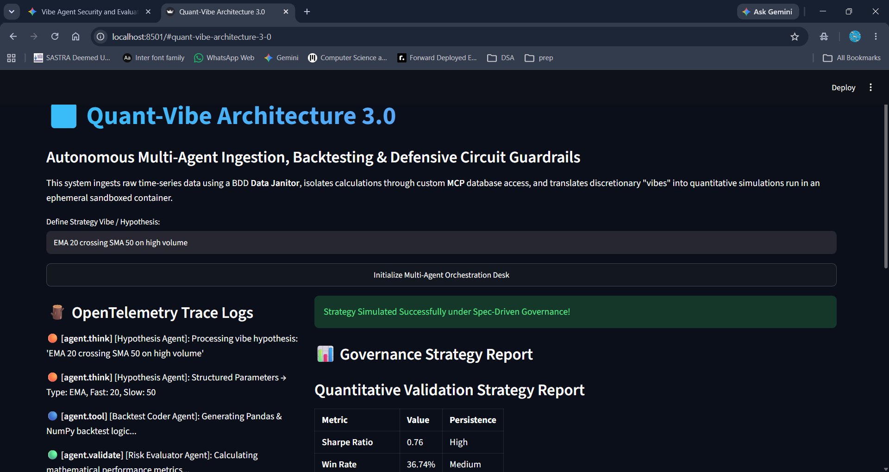

# Quant-Vibe Architecture 3.0
**Autonomous Multi-Agent Backtesting for Institutional Equity Markets**

**Author:** Chaarudarshini K. | Btech CSE(IoT and Automation), SASTRA University  
**Track:** Agents for Business (Kaggle AI Agents Capstone)



---

## ⚠️ The Problem: The Illusion of LLM Alpha

In algorithmic trading, translating a discretionary market hypothesis (a "vibe") into a mathematically rigorous backtest is highly bottlenecked by manual coding. While Large Language Models (LLMs) can generate Python code, utilizing raw LLMs for quantitative research introduces three catastrophic failures:
1.  **Market Hallucination:** LLMs frequently guess or interpolate missing historical financial data rather than halting execution.
2.  **Execution Ignorance:** LLMs typically ignore critical market microstructure realities, such as slippage and the bid-ask spread.
3.  **Lookahead Bias:** LLMs consistently fail to shift trading signals by one period, accidentally utilizing future closing prices to make current trading decisions.

These failures create the "Illusion of LLM Alpha"—a simulated equity curve that looks flawless but instantly destroys capital in live markets.

---

## 💡 The Solution: Spec-Driven Agentic Orchestration

**Quant-Vibe Architecture 3.0** solves this by abandoning the single-prompt LLM paradigm. Instead, it deploys an autonomous, multi-agent "Quant Desk" governed by strict Behavior-Driven Development (BDD) specifications and active circuit breakers.

By dividing the quantitative workflow into discrete, specialized agents (Data Ingestion, Strategy Formatting, Python Engineering, and Risk Evaluation), the system constrains the LLM's operational boundaries. We force the AI to verify its own logic against an immutable SQLite database via a Model Context Protocol (MCP) server, translating discretionary hypotheses into strict statistical parameters that safely account for real-world execution friction.

---

## 🏗️ Architecture 

The architecture is built in Python 3.12 and operates in six tightly coupled phases:

### 1. Asynchronous Data Ingestion (The Data Janitor)
*   **Retrieval:** Pulls complete historical daily OHLCV data for the Nifty 100 (`^CNX100`) via `yfinance`.
*   **BDD Data Janitor:** An autonomous agent governs data cleaning. It applies forward-fill (`ffill()`) imputation for missing prices and clamps volume anomalies (>5 standard deviations) to a rolling median.

### 2. The Secure Data Bridge (MCP Server)
*   A custom MCP server acts as the sole data bridge for the trading agents, exposing a strictly **read-only** tool: `fetch_nifty100_ohlcv`. 
*   By explicitly denying `INSERT` or `UPDATE` access, the system physically eliminates the LLM's ability to arbitrarily "correct" or hallucinate historical market prices.

### 3. The "Quant Desk" Pipeline (Agent Development Kit)
*   **The Hypothesis Agent:** Parses natural language to extract structured parameters (e.g., classifying "EMA 20 crossing SMA 50" into JSON).
*   **The Backtest Coder Agent:** Autonomously generates isolated `pandas` logic. It enforces a realistic 0.1% execution friction model per trade and strictly applies signal shifting (`.shift(1)`) to prevent lookahead bias.
*   **The Risk Evaluator Agent:** Calculates mathematical metrics, including the Annualized Sharpe Ratio and Structural Persistence.

### 4. Active Defense & Sandboxing
*   **Ephemeral Runtimes:** Generated scripts are executed in a subprocess with a strict 5-second timeout.
*   **AgBOM Verification:** Uses `ast.parse()` to audit the Runtime Agent Bill of Materials. Only whitelisted modules (`pandas`, `numpy`, `math`, etc.) are permitted. 
*   **Drawdown Monitor:** If the simulated strategy triggers a 99.99% max drawdown, the circuit breaker freezes execution to prevent capital destruction.

### 5. Streamlit Dashboard 
*   An interactive local UI displaying OpenTelemetry-style trace logs alongside Vega-Lite equity curves and structured governance reports.

---

## 🚀 Instructions for Setup

### 1. Install Dependencies

Ensure you have Python 3.12+ installed. Clone the repository, navigate to the `quant` folder, and install the required libraries:

```bash
pip install -r requirements.txt
```

### 2. Fetch and Ingest Market Data

Download historical data for the Nifty 100 index (`^CNX100`) from Yahoo Finance and clean/populate the local SQLite database:

```bash
# 1. Download historical data (generates nifty100_historical.csv)
python download_data.py

# 2. Clean volume anomalies & ingest to SQLite (generates nifty100.db)
python data_janitor.py
```

### 3. Run the Streamlit Application

Start the web application dashboard locally:

```bash
streamlit run app.py
```

Open your browser to `http://localhost:8501` to use the strategy simulator dashboard!

---

## File Structure

- `app.py`: Streamlit dashboard and UI visualization.
- `quant_desk.py`: Multi-agent pipeline orchestrating the Hypothesis, Coder, and Risk Evaluator agents.
- `circuit_breaker.py`: The security sandbox/guardrails (static analysis, dependency analysis, drawdown guardrails).
- `sandbox.py`: Sandbox runner for executing code.
- `download_data.py` & `data_janitor.py`: Scripts to download and prepare SQLite database.
- `mcp_server.py`: Model Context Protocol server skeleton to expose database tools.
- `requirements.txt`: Python package dependencies.

---

## 📊 Verified Execution Results

Below is the output generated by the Risk Evaluator Agent for the initial hypothesis prompt: "EMA 20 crossing SMA 50".

| Metric                      | Value  |
| --------------------------- | ------ |
| **Sharpe Ratio**            | 0.76   |
| **Win Rate**                | 36.74% |
| **Max Drawdown**            | 30.76% |
| **Final Equity Multiplier** | 7.09×  |
| **Persistence Score**       | 0.6924 |
